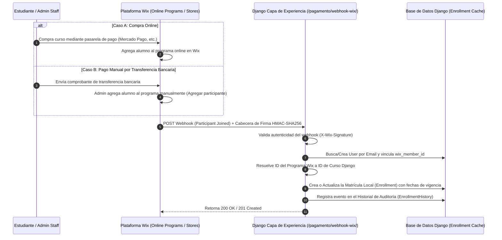

# Plan Técnico Detallado - Fase 1: Sincronización de Accesos y Permisos (Wix ➔ Django)

Este documento define la especificación técnica para que Django actúe como un **espejo de permisos en tiempo real** de Wix. Toda alta de alumnos (por compra directa en la pasarela o por transferencia bancaria manual) se gestionará en el panel de **Wix** y se sincronizará automáticamente hacia **Django** mediante **Webhooks**.

---

## 1. Flujo de Datos Híbrido (Autoridad en Wix, Espejo en Django)



---

## 2. Webhooks Requeridos desde Wix

Wix enviará notificaciones HTTP POST en tiempo real hacia Django ante cambios de accesos en su sistema.

### 2.1 Endpoint del Webhook
* **Ruta:** `/pagamento/webhook-wix/`
* **Método:** `POST`
* **Seguridad:** Cabecera `X-Wix-Signature` con firma HMAC-SHA256 generada a partir de una clave compartida secreta (`WIX_WEBHOOK_SECRET`).

### 2.2 Eventos Sincronizados
* **`OnlinePrograms_ParticipantJoined` / `PaidPlans_PlanPurchased`**:
  * Indica que el alumno ha adquirido acceso (por compra o por invitación manual del staff en Wix).
  * Django crea el usuario (si es nuevo) y activa/extiende la matrícula (`Enrollment`).
* **`OnlinePrograms_ParticipantLeft` / `PaidPlans_PlanCancelled`**:
  * Indica que el acceso ha expirado, ha sido cancelado o removido en Wix.
  * Django desactiva el acceso local (`is_active = False`) y registra la fecha de revocación.

---

## 3. Modelos Django y Campos de Espejo

Los modelos de Django actúan como un **caché local** rápido de los permisos de Wix:

### 3.1 `accounts.models.Profile`
* `wix_member_id` (CharField, único): Guarda el identificador único del miembro de Wix para unificar identidades en futuras interacciones y SSO.

### 3.2 `courses.models.Enrollment` (Caché de Accesos)
* `user`: Usuario local vinculado.
* `course`: Curso correspondiente.
* `start_date` / `expiration_date`: Fechas sincronizadas desde Wix.
* `access_source`: Mapea cómo se originó el acceso en Wix (valores: `wix` para compras online, `transferencia` para altas manuales por transferencia registradas en Wix, `cortesia` para invitaciones libres, `ajuste_manual` para correcciones).
* `is_active` (Boolean): Refleja si el alumno tiene derecho de acceso actual.
* `internal_notes` (TextField): Guarda detalles del webhook (ej. *"Sincronizado desde Wix el 07/07/2026 04:30. Origen: Invitación Manual"*).

### 3.3 `courses.models.EnrollmentHistory` (Auditoría de Sincronización)
* Guarda el historial de todas las altas, renovaciones, expiraciones y bajas sincronizadas desde Wix para auditorías de soporte técnico.

---

## 4. Payload Esperado del Webhook (Ejemplo)

```json
{
  "event": "OnlinePrograms_ParticipantJoined",
  "timestamp": 1719859200000,
  "data": {
    "wix_member_id": "wix-member-user-123",
    "email": "alumno.ejemplo@alumed.com",
    "first_name": "Joyce",
    "last_name": "Marinho Cordeiro",
    "product_or_plan_id": "wix-plan-anual-histo-2026",
    "access_source": "transferencia",
    "amount_paid": 15000.00,
    "start_date": "2026-07-07T00:00:00Z",
    "expiration_date": "2027-07-07T00:00:00Z"
  }
}
```

---

## 5. El Panel Administrativo de Django (Read-Only Mirror / Auditoría)

Dado que **Wix es el panel oficial de control de alumnos**:
* El panel de administración de Django `/admin` servirá como **visor de auditoría**.
* Los registros de `Enrollment` y `EnrollmentHistory` se mostrarán en formato detallado pero de **solo lectura** (o con edición restringida solo para soporte de emergencia en desarrollo).
* Esto evita que un administrador modifique un acceso localmente en Django, creando un conflicto o desalineación con el backend real de Wix.

---

## 6. Pruebas Locales (Sin Afectar Producción)

* Se mantendrá el uso del script de testeo local `scratch/test_webhook.py`.
* Este script simulará tanto eventos automáticos de compra en Wix como eventos de liberación manual de transferencias en Wix, enviando los payloads de prueba firmados correspondientes y comprobando que Django guarde la información de forma coherente.
* Permite depurar la lógica y el mapeo de planes locales con la base de datos sqlite de pruebas.

---

## 7. Riesgos y Mitigaciones Técnicas

* **Riesgo 1: Duplicidad de Matrículas.**
  * *Mitigación:* Django valida mediante una clave compuesta implícita (`user_id`, `course_id`) y actualiza el registro existente (`Enrollment.objects.filter(user=user, course=course).first()`) extendiendo la expiración, en lugar de duplicar registros.
* **Riesgo 2: Eventos fuera de orden (ej. Baja procesada antes que una compra tardía).**
  * *Mitigación:* Los logs de webhook incluyen un `timestamp` de origen en Wix. Django validará que el timestamp del evento entrante sea posterior al último cambio registrado en el historial de la matrícula para no aplicar actualizaciones obsoletas.

---

## 8. Checklist de Ajustes e Implementación

- [ ] **Paso 1:** Actualizar variables en `alumed/settings.py` para soportar las firmas y mapear los identificadores oficiales de programas de Wix.
- [ ] **Paso 2:** Ajustar `courses/services.py` y `payments/webhooks.py` para recibir el parámetro `access_source` enviado por el webhook de Wix y sincronizarlo sin dar de alta alumnos de forma manual local.
- [ ] **Paso 3:** Configurar el Django Admin `courses/admin.py` para actuar principalmente como un visor de auditoría y evitar colisiones de datos.
- [ ] **Paso 4:** Correr pruebas locales con `scratch/test_webhook.py` simulando tanto orígenes `wix` como `transferencia` sincronizados desde el backend.
