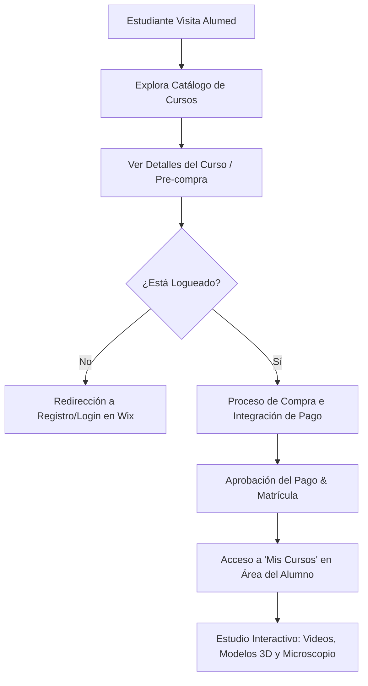

# Contexto del Proyecto ALUMED
> **RELEASE VERSION:** ALUMED OS Release 1.0 - Core Platform
> **STATUS:** STABLE

Este documento define la filosofía, arquitectura, identidad visual y reglas de desarrollo del ecosistema ALUMED. Su propósito es servir como la única fuente de verdad y guía de diseño para cualquier desarrollo futuro, garantizando la compatibilidad con la plataforma base (Wix) y manteniendo una experiencia de usuario (UX/UI) cohesiva y premium.

---

## 1. Filosofía y Enfoque del Proyecto

> [!IMPORTANT]
> **NUESTRA MISIÓN:** Desarrollar nuevas funcionalidades y modernizar la experiencia del estudiante de medicina, manteniendo compatibilidad total e integración nativa con Wix.
>
> * **NO** vamos a recrear el sitio web principal.
> * **NO** vamos a reemplazar a Wix.
> * **WIX ES EL BACKEND OFICIAL** de ALUMED. Toda la lógica central e infraestructura de negocio continuará bajo su responsabilidad.

### Responsabilidades de Wix:
* **Autenticación y Cuentas:** Login, registro y flujo de miembros.
* **Pagos y Checkout:** Procesamiento de compras y pasarela de pago.
* **Administración de Miembros:** Roles, accesos y permisos.
* **Cursos y Contenido Base:** Gestión de módulos principales y alumnos inscritos.

Cualquier desarrollo en este repositorio Django/Python está diseñado para **añadir valor y expandir** esta infraestructura, nunca duplicar o reemplazar sus componentes esenciales.

---

## 2. Análisis del Sitio Existente (https://www.alumedestudiantes.com/)

A partir de la inspección visual y la navegación, se extraen las siguientes directrices y patrones de diseño:

### 2.1 Identidad Visual y Paleta de Colores
ALUMED emplea un diseño premium de alto contraste, diseñado para destacar en entornos de estudio (modo oscuro por defecto):
* **Fondo Principal (Background):** Tonos morados y violetas muy oscuros (`#1E1233` o similar), acompañados de texturas sutiles de cuadrículas y gráficos médicos (esquemas anatómicos, radiografías o esqueletos en el banner principal).
* **Colores de Acento (High Contrast):** Amarillo brillante / Naranja (`#FFE600` / `#FF9900`) para textos importantes, botones primarios (CTA), barras de progreso activas y el menú lateral del reproductor.
* **Tipografía:** Combinación moderna y premium usando fuentes de Google Fonts:
  * **Títulos e Interfaz:** *Outfit*, *Sora*, *Manrope*.
  * **Texto de Lectura:** *Inter*.
  * **Estilos Decorativos:** *Cinzel Decorative*, *Dancing Script*, *Quicksand*.
* **Iconografía:** Uso consistente de *Font Awesome 6.0* en toda la plataforma.

### 2.2 Landing Page y Navegación
* **Estructura del Header:** Logotipo circular clásico de "Instituto Alumed" con una doctora en el centro, ubicado sobre un fondo púrpura texturizado.
* **Menú Superior:** Barra translúcida (efecto de cristal/glassmorphism) con botones directos a:
  * `INICIO`
  * `CURSOS`
  * `MedTV`
  * `BIBLIOTECA VIRTUAL`
  * `MICROSCOPIO VIRTUAL`
* **Selector de Moneda:** Dropdown para cambiar de divisas (por defecto en ARS).
* **Identificador de Usuario:** Menú desplegable en la esquina superior derecha que muestra el nombre completo del alumno y una campana de notificaciones.

### 2.3 Catálogo de Cursos (Cursos y Planes)
* **Organización:** Cursos agrupados por facultades y objetivos académicos (UNLP, UBA, Barceló, PREMED).
* **Ficha del Curso (Cards):** Cada curso cuenta con un color de identidad en su tarjeta e imagen de portada para fácil escaneo visual:
  * **Naranja/Ocre:** Histología y Embriología.
  * **Rojo/Carmesí:** Anatomía.
  * **Verde/Esmeralda:** Biología.
* **Interacciones del Card:** Botón para verificar estado de suscripción ("Eres un participante") y un botón para abrir el programa ("VER EL PROGRAMA").

### 2.4 El Área del Alumno ("Mis Cursos")
Esta es la interfaz más crítica de la plataforma y sirve como **referencia absoluta** para la maquetación de futuras características:
1. **Listado de Cursos:** Pestañas simples para alternar entre cursos "Activos" y "Completados".
2. **El Reproductor de Clases (Player):**
   * **Sidebar Izquierda (Menu Lateral):** Fondo amarillo de alto contraste con texto en negro. Muestra el título del curso, porcentaje de avance (por ejemplo, `2%`), y un menú desplegable de módulos (ej. `INFO + APUNTES`, `HISTOLOGIA`) con iconos de estado para cada clase (icono de documento o checkmark de completado).
   * **Visualizador Central:** Caja principal con borde amarillo que contiene el reproductor de video o la herramienta interactiva.
   * **Controles Inferiores:** Barra con botones estilizados en amarillo y morado para retroceder ("Anterior") o finalizar el paso actual ("COMPLETAR PASO >").
3. **Chat de Miembros:** Botón flotante púrpura con texto naranja ("Chat de miembros") disponible en la esquina inferior izquierda.

---

## 3. Arquitectura y Reglas de Desarrollo

Para garantizar que el backend de Django trabaje en perfecta armonía con Wix, se imponen las siguientes reglas arquitectónicas:

| Componente | Plataforma Responsable | Flujo de Integración / Django |
| :--- | :--- | :--- |
| **Registro y Acceso** | **Wix** | Las URLs de login/registro en Django redirigen al portal oficial de Wix. |
| **Verificación de Sesión** | **Híbrida** | Django valida que el usuario esté autenticado para proteger rutas sensibles (decorador `@student_auth_required`). |
| **Pasarela de Pago** | **Wix / Mercado Pago** | El proceso de pago se gestiona mediante la generación de preferencias seguras de Mercado Pago vinculadas a las cuentas oficiales del Instituto. |
| **Material Adicional** | **Django (Google Cloud Storage)** | Django sirve recursos pesados como imágenes de microscopía de alta resolución, modelos 3D y descargas seguras desde GCS. |

### Reglas de Diseño UI/UX en Django:
1. **Consistencia Cromática:** Todos los templates HTML creados o editados en Django deben imitar el modo oscuro morado, los acentos amarillos y las fuentes de Google Fonts especificadas.
2. **Experiencia Responsiva:** Todas las vistas deben contar con layouts optimizados para dispositivos móviles (como `course_dashboard_mobile.html` y `deck_list_mobile.html`).
3. **Sin Placeholders:** No usar cajas vacías ni imágenes de prueba genéricas. Utilizar recursos del proyecto o generar imágenes acordes a la estética médica/científica de la plataforma.

---

## 4. Flujo de Experiencia del Alumno (Customer Journey)

1. **Ingreso:** El estudiante accede a la plataforma principal.
2. **Selección:** Navega por los programas académicos y selecciona el curso de su interés.
3. **Autenticación:** Si no ha iniciado sesión, es redirigido a los formularios oficiales en Wix.
4. **Adquisición:** Realiza el checkout seguro.
5. **Estudio:** Accede a la plataforma interactiva (reproductor de clases, descarga de apuntes, visualización en 3D de anatomía o uso del microscopio virtual).
6. **Progreso:** Marca pasos como completados para actualizar su avance global en tiempo real.
