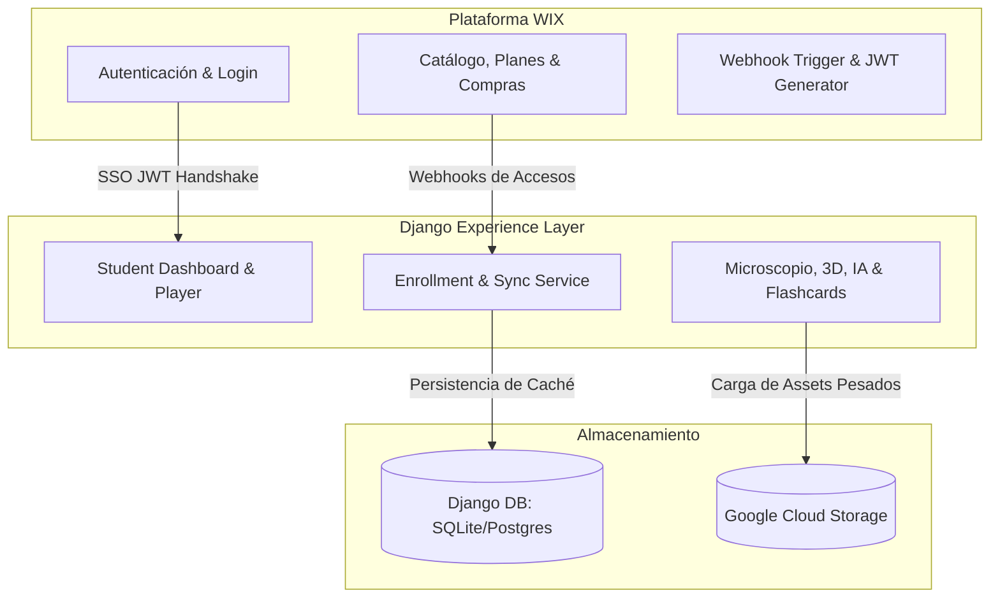
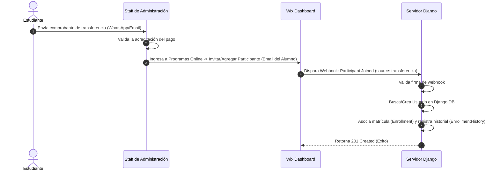
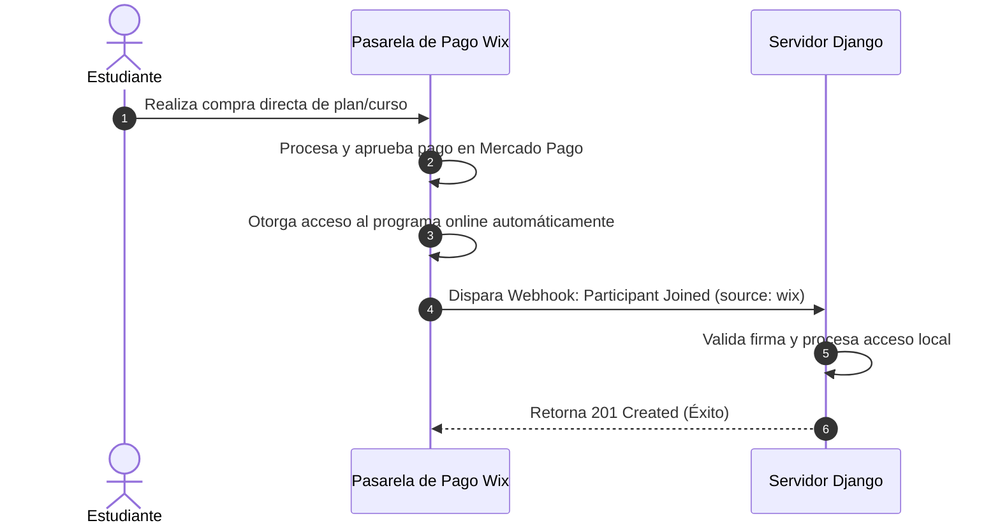

# ALUMED - SYSTEM BLUEPRINT (Plano General del Sistema)

Este documento es el plano arquitectónico y funcional oficial del ecosistema **ALUMED**. Define las responsabilidades de cada sistema, los flujos del alumno, mapas de páginas, dependencias y reglas de diseño para guiar el desarrollo de cualquier ingeniero de software o agente de Inteligencia Artificial que trabaje en el proyecto.

---

## 1. Visión General del Ecosistema

El ecosistema de **ALUMED** está estructurado bajo un modelo híbrido de **Capa de Experiencia (Experience Layer)** integrada a un motor operativo:
* **Backend de Negocio y Autoridad (Wix):** Gestiona la captación de usuarios, catálogo público, compras, procesamiento de pagos y es la **fuente de verdad absoluta** para la existencia de cuentas y la adjudicación de accesos a cursos.
* **Capa de Experiencia Interactiva (Django):** Funciona como el espacio educativo avanzado de alto rendimiento para el estudiante. Sincroniza en tiempo real los datos desde Wix y expone herramientas interactivas (microscopio, visualizadores 3D, flashcards y tutoría IA) integradas en una UI premium morada/amarilla de alto contraste.

---

## 2. Responsabilidad de cada Sistema



### 2.1 Wix
* **CRM y Miembros:** Registro primario de usuarios, perfiles de contacto y roles.
* **Ventas y Checkout:** Pasarela de pago activa (Mercado Pago), cobros recurrentes y planes de suscripción.
* **Administración de Cursos:** Definición oficial de programas académicos y asignación de participantes (online o manual).

### 2.2 Django
* **Workspace del Estudiante:** Renderizado de la experiencia de estudio unificada (Dashboard, reproductor de clases, etc.).
* **Herramientas de Gamificación y Multimedia:** Lógica de flashcards, comentarios de clases, likes, tracking de lecciones completadas.

### 2.3 Banco de Datos (Estructura Híbrida)
* **Base de Datos Wix:** Mantiene los registros maestros de transacciones y estados de suscripciones.
* **Base de Datos Django (SQLite / Postgres):** Actúa como un caché rápido para validar permisos y almacenar los datos específicos de interacción (mazos de tarjetas, foros, historial de auditorías, chatmed, etc.).
* **Google Cloud Storage (GCS):** Repositorio externo para alojar de forma escalable láminas histológicas de microscopía, modelos anatómicos 3D, audios de podcasts y libros digitales en PDF.

### 2.4 Inteligencia Artificial (IA)
* **IA Profe Joy:** Tutor virtual médico integrado que responde consultas académicas contextualizado en los contenidos del curso usando APIs de LLMs (como OpenAI).

### 2.5 Biblioteca
* **Digital Library:** Repositorio en Django que sirve guías de estudio, resúmenes y material complementario en PDF protegidos por verificación de matrícula activa.

### 2.6 Conecta (FCM)
* **Integración FCM (Facultad de Ciencias Médicas):** Módulo académico de Django que reúne calendarios de trabajos prácticos, distribución de comisiones de cátedra de la universidad y el módulo de bienestar estudiantil ("Apoyo Psicológico Conecta").

---

## 3. Flujo Completo del Alumno (Customer Journey)

1. **Visitante:** El usuario ingresa al sitio público de ALUMED (Wix), explora las opciones de estudio, parciales y precios.
2. **Registro:** Completa el formulario de registro oficial integrado en el módulo de miembros de Wix.
3. **Compra:**
   * *Opción A:* Compra online y es asignado al curso en Wix de manera automática.
   * *Opción B:* Paga por transferencia manual, envía comprobante, y administración de ALUMED lo agrega al programa en Wix de forma manual.
4. **Login:** El estudiante inicia sesión en Wix. Al ingresar, hace clic en "Ir a la Plataforma" (Django).
5. **SSO Handshake:** Wix genera un JWT firmado. Django lo recibe, valida la autenticidad, crea/actualiza el usuario localmente, e inicia la sesión en Django sin pedir contraseñas.
6. **Estudio (Cursos y Herramientas):** El alumno ingresa a su Dashboard, abre el reproductor, estudia con las herramientas 3D, microscopio, flashcards y tutoría IA.

---

## 4. Flujo para Pagos Manuales (Transferencia)



---

## 5. Flujo para Pagos Online (Wix Checkout)



---

## 6. Mapa de Todas las Páginas

### 6.1 Páginas Administradas por Wix
* **Página de Inicio / Landing Page:** `/` (Pública, institucional).
* **Catálogo de Cursos:** `/cursos` (Público, informaciones comerciales).
* **Página del Producto / Detalle:** `/curso-individual` (Pre-compra).
* **Planes de Precios / Suscripción:** `/planes` (Opciones de membresías).
* **Flujo de Pago:** `/checkout` (Ingreso de datos de tarjeta/Mercado Pago).
* **Login y Registro:** `/login` y `/registro` (Módulo de miembros oficial).

### 6.2 Páginas Administradas por Django (Capa de Experiencia)
* **Dashboard del Alumno:** `/dashboard/` (Estadísticas, mis cursos, últimos avisos, calendario y gamificación).
* **Listado de Alumnos:** `/students/` (Directorio interno de perfiles).
* **Detalle de la Cuenta:** `/details/` (Ajustes de perfil, foto e historial de accesos).
* **Biblioteca Virtual:** `/biblioteca/` (Descarga de guías, libros de cátedra y apuntes).
* **Microscopio Virtual:** `/microscopio-virtual/` (Laminario histológico interactivo).
* **Anatomía 3D:** `/anatomia-3d/` (Modelos tridimensionales interactivos).
* **Cartelera FCM:** `/cartelera/` (Novedades raspadas en tiempo real de la universidad).
* **Módulo Conecta FCM:** `/conecta-fcm/` (Accesos a cronogramas y comisiones).
* **Apoyo Psicológico Conecta:** `/apoyo-psicologico/` (Herramienta de bienestar, medidor de humor y relax).
* **Reproductor de Clases:** `/cursos/<id>/` (Visor de videos, apuntes del módulo, likes y comentarios de alumnos).
* **Dashboard de Flashcards:** `/cursos/flashcards/` (Estadísticas y acceso a mazos de repaso).
* **Chatmed (Chat de Miembros):** `/chatmed/` (Mensajería directa entre alumnos y profesores).
* **Foro de Consultas:** `/foro/` (Tópicos de preguntas académicas y respuestas categorizadas por materia).

---

## 7. Mapa de Permisos

| Rol / Estado | Permisos en Wix | Permisos en Django | Acceso Permitido |
| :--- | :--- | :--- | :--- |
| **Visitante** | Ninguno | Ninguno | Páginas públicas de Wix, Landing page y detalles comerciales. |
| **Miembro Registrado** | Cuenta activa (sin plan) | Cuenta activa (sin matrícula) | Acceso a perfiles de miembros básicos en Wix, Login, foro público (solo lectura). |
| **Estudiante Activo** | Inscripción en programas online o plan activo en Wix | Matrícula activa registrada en Django (`Enrollment.is_active = True`) | Acceso completo al Dashboard, clases, microscopio virtual, anatomía 3D, IA, descargas de biblioteca, chat y flashcards. |
| **Staff de Administración** | Rol de Admin en Wix | Usuario `is_staff = True` en Django | Acceso al panel administrativo de Django (`/admin`) para auditorías, logs y configuraciones de contenidos. |

---

## 8. Mapa de todos los Módulos de Django

* **`accounts`:** Maneja los perfiles de los usuarios (`Profile`), mensajería del chat interno (`ChatMessage`), y vistas de dashboards/configuraciones de cuenta.
* **`courses`:** Administra la estructura de aprendizaje (`Course`, `Module`, `Lesson`, `PodcastEpisode`), almacenamiento y visualización de flashcards (`Deck`, `Flashcard`), comentarios y likes de clases, y el estado de accesos (`Enrollment`, `EnrollmentHistory`).
* **`core`:** Concentra las páginas de valor agregado del estudiante: microscopio virtual, visualización de anatomía 3D, biblioteca digital (`DigitalBook`), scraping de carteleras oficiales FCM y el portal de bienestar y apoyo psicológico.
* **`forum`:** Sistema de discusiones para resolución de dudas médicas (`Topic`, `Reply`).
* **`payments`:** Maneja las integraciones y procesa los webhooks de pasarelas de pago y sincronización de Wix.

---

## 9. Dependencias entre Módulos de Django

```
┌───────────┐         ┌───────────┐
│  accounts │◄────────┤  courses  │ (Matrícula requiere usuario)
└─────▲─────┘         └─────▲─────┘
      │                     │
      │ ┌───────────┐       │
      ├─┤   forum   ├───────┤       (Tópicos requieren usuario y curso)
      │ └───────────┘       │
      │                     │
      │ ┌───────────┐       │
      ├─┤   core    ├───────┘       (Herramientas validan matrícula activa)
      │ └───────────┘
      │
┌─────┴─────┐
│  payments │                       (Webhooks crean usuario y otorgan matrícula)
└───────────┘
```

---

## 10. Reglas para Futuras Implementaciones (Guía de Oro)

1. **Wix es la Fuente de la Verdad:** Nunca escribas flujos en Django que otorguen, modifiquen o revoquen accesos de forma permanente saltándose el registro de Wix. Toda alta de matrículas debe sincronizarse mediante el endpoint de Webhooks.
2. **Cero Duplicación de Negocio:** No desarrolles formularios de login, registro, pasarelas de pago de suscripción o checkouts directamente en Django. Usa redirecciones hacia Wix.
3. **Consistencia en Diseño y Experiencia:**
   * Utiliza la paleta de colores oficial: Fondos morados oscuros (`#1E1233`), acentos en amarillo brillante/naranja (`#FFE600`/`#FF9900`), textos blancos limpios.
   * La interfaz debe ser fluida, responsiva y veloz (optimización para móviles obligatoria).
   * Incorporar microanimaciones utilizando la librería *Animate.css* integrada.
4. **Seguridad y Verificación:**
   * Proteja todas las vistas de herramientas de Django usando el decorador de seguridad `@student_auth_required`.
   * Todo endpoint de webhook expuesto debe verificar firmas HMAC-SHA256 con un secreto seguro y único antes de realizar cualquier cambio en base de datos.
5. **Assets Externos para Escalabilidad:** No guardes archivos multimedia pesados (videos de clases, audios de podcast, láminas HD, libros) directamente en la base de datos de Django o el servidor de hosting. Suba los archivos a **Google Cloud Storage (GCS)** y use URLs normalizadas o firmadas.
